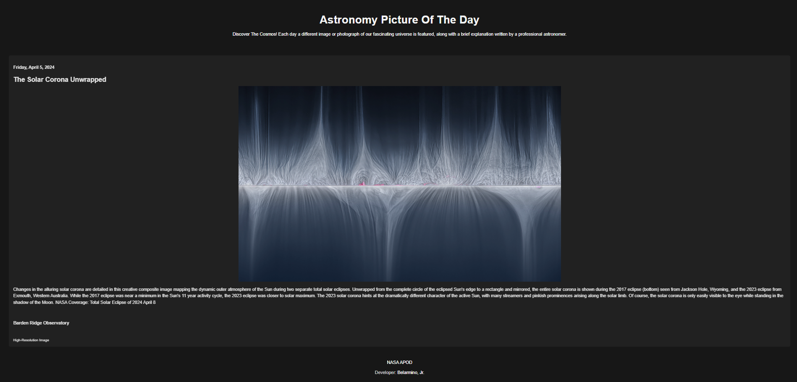

## APOD Webpage: Astronomy Picture of the Day

This project is a webpage inspired by NASA's Astronomy Picture of the Day (APOD) ([https://apod.nasa.gov/apod/archivepixFull.html](https://apod.nasa.gov/apod/archivepixFull.html)). It displays the daily featured image or photograph of our universe along with a brief explanation written by a professional astronomer.

### Features

- Fetches data from NASA's APOD API.
- Displays the image, title, date, explanation, copyright, and a link to the high-resolution version (if available).
- Handles cases where no image data is found for the day.
- Implements a toggle button to switch between dark and light mode for better user experience.

### Inspiration

This project is heavily inspired by NASA's APOD website ([https://apod.nasa.gov/apod/archivepixFull.html](https://apod.nasa.gov/apod/archivepixFull.html)). It aims to provide a similar experience for users to explore the wonders of our universe.

### Technologies Used

- HTML: Provides the structure of the webpage.
- CSS: Styles the layout and visual elements of the webpage.
- JavaScript: Fetches data from the API, manipulates the DOM to display information, and implements dark/light mode functionality.

### Demo

### Live Demo

[Click here to see the webpage](https://wonderr-astronomy-picture-of-the-day.netlify.app/)

### Usage

1. Clone this repository.
2. Open the `index.html` file in a web browser.

The webpage should automatically fetch data and display the Astronomy Picture of the Day.

### License

This project is licensed under the MIT License: [https://choosealicense.com/licenses/mit/](https://choosealicense.com/licenses/mit/).

### Credits

- **NASA APOD:** [https://apod.nasa.gov/apod/archivepixFull.html](https://apod.nasa.gov/apod/archivepixFull.html) (Inspiration and Data Source)
